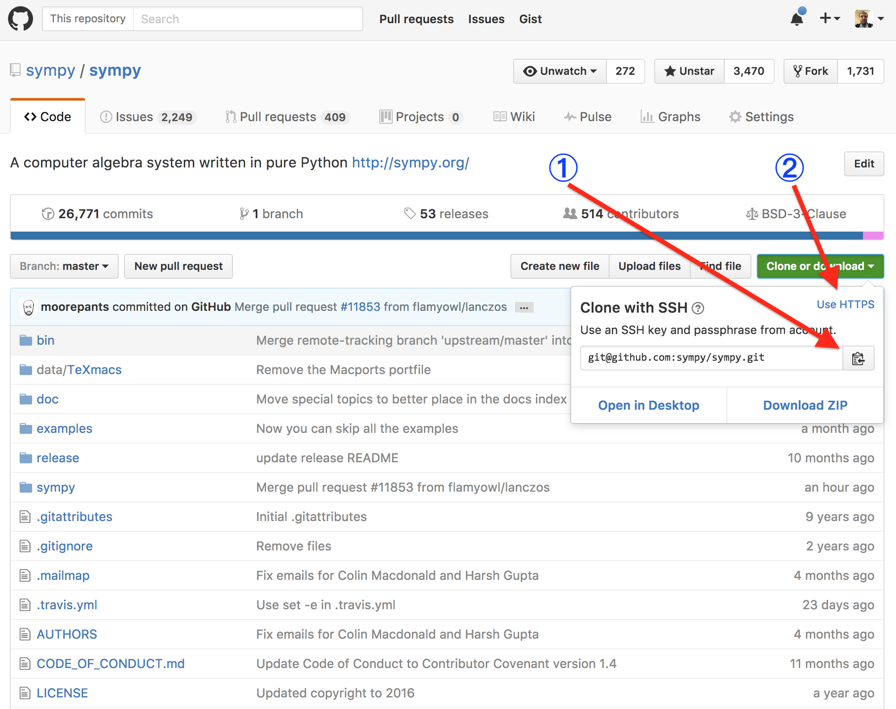

# Git workflow

This document describes the git workflow that should be used when contributing
to open source projects. It assumes a very basic understanding of git
(commits, branches, etc.) using the command line.

**Note: This workflow is designed for open source (i.e., public)
repositories. The workflow for private repositories may be slightly different,
in particular, the repository's team may prefer for you to not fork the repo
but rather push branches to it directly (although note that GitHub does allow
you to fork private repositories that you have push access to and keeps the
fork private).**

For this document, we will suppose that you want to contribute a patch to
[conda/conda](https://github.com/conda/conda).

## Cloning and forking the repository

**Note: The steps in this section only need to be performed once per
repository (i.e., if you contribute a second change to conda/conda, you would
not need to repeat them, but if you contribute to
[conda/conda-build](https://github.com/conda/conda-build) you will need to
repeat them for that repository.**

1. Clone the repository. Copy the url ① and type, in this case

   ```
   git clone git@github.com:conda/conda.git
   ```

   at the terminal. If you have not set up your ssh keys with GitHub, use the
   https url by first clicking the `https` button ②.

   
