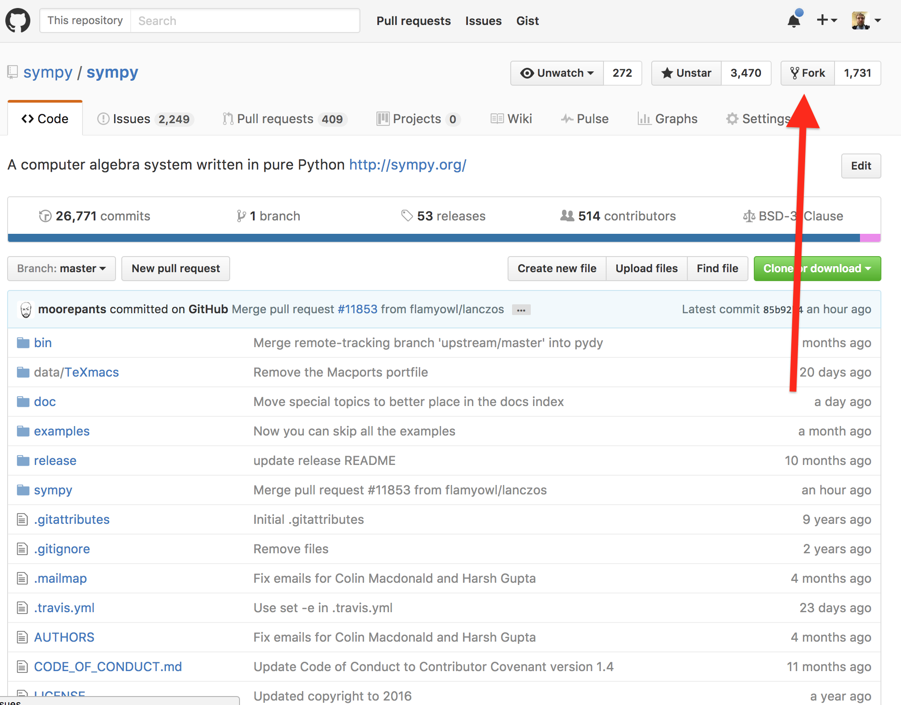
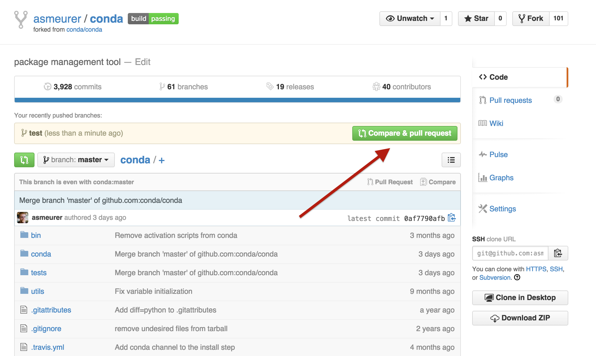
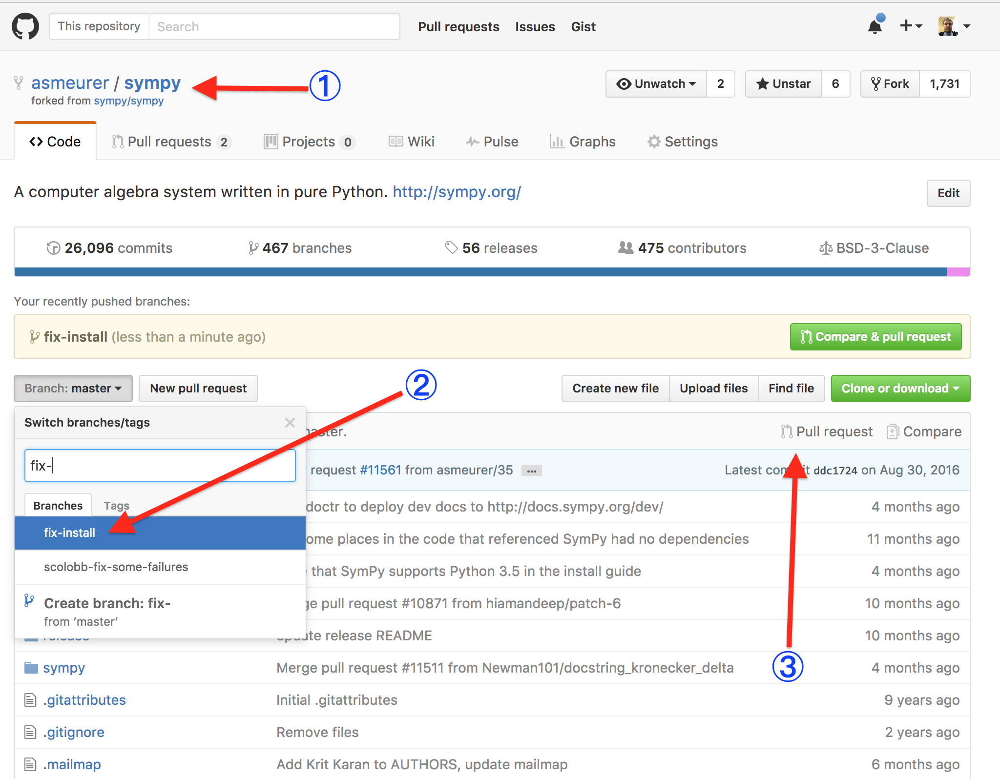
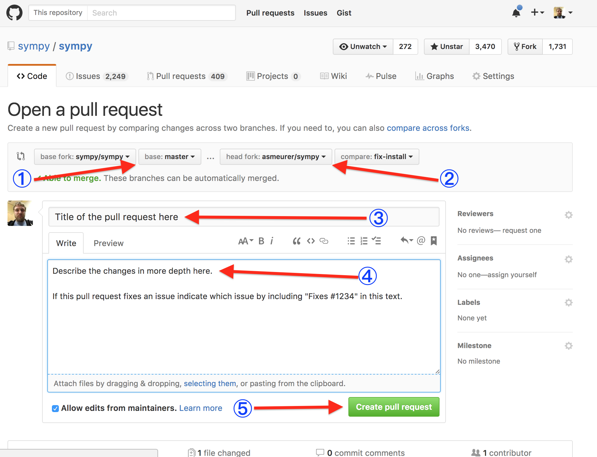

# Git workflow

This document describes the git workflow that should be used when contributing
to open source projects on GitHub. It assumes a very basic understanding of
git (commits, branches, etc.) using the command line.

*Note: This workflow is designed for open source (i.e., public)
repositories. The workflow for private repositories may be slightly different,
in particular, the repository's team may prefer for you to not fork the repo
but rather push branches to it directly (although note that GitHub does allow
you to fork private repositories that you have push access to and keeps the
fork private).*

For this document, we will suppose that you want to contribute a patch to
[sympy/sympy](https://github.com/sympy/sympy).

**<font size=4>NOTE: If you want to test out this guide without making an
actual fix, please test against THIS REPO (`asmeurer/git-workflow`). Do not
make a pull request against `sympy/sympy` unless you are making an actual
change.</font>**

## Cloning and forking the repository

**Note: The steps in this section only need to be performed once per
repository (e.g., if you contribute a second change to sympy/sympy, you would
not need to repeat them, but if you contribute to
[sympy/sympy-live](https://github.com/sympy/sympy-live) you will need to
repeat them for that repository).**

1. **Clone the repository.** Click the green "<font color="green">Clone or download</font>" button <font color="blue">①</font>,
   and copy the url <font color="blue">②</font> and type

   <code>git clone <i>clone-url</i></code>

   at the terminal. Replace *`clone-url`* with the url that has been copied to
   your clipboard. For sympy/sympy, it will be
   `git@github.com:sympy/sympy.git`. If you have not set up your ssh keys with
   GitHub, use the https url by first clicking the `https` button <font
   color="blue">③</font>.

   

   *Note: It is important that you clone from the repo you are contributing
   to (like sympy/sympy),* not *your fork of the repo.*

2. **Fork the repo on GitHub to your personal account.** Click the `Fork`
   button on the sympy/sympy page.

   

   If you are presented with a list of organizations, click on your GitHub
   username.

3. **Add your fork as a remote.** This remote will be named after your github
   username.  Go to the fork of your repository, in this case,
   <code>https://github.com/<i>your-username</i>/sympy</code> (replace *`your-username`* with
   your GitHub username), and copy the clone url as in step 1. `cd` to your
   clone from step 1 and run

   <code>
   git remote add <i>your-github-username</i> <i>fork-url</i>
   </code>

   (replace *`your-github-username`* with your GitHub username and
   *`fork-url`* with the url that was copied to your clipboard). You will be
   able to tell it is your fork url because it will have your GitHub username
   in it. For instance, if your username is `github_user`, you would run the
   command `git remote add github_user git@github.com:github_user/sympy.git`.

Remember, the above three steps only need to be performed once per
repository. Once you have cloned and forked a repository once, there is no
need to clone or fork it again.

## Making changes

Before you make any changes, you should make a branch. Remember to **never
commit to master**. The command `git status` will tell you what branch you are
on. I recommend putting the git branch in your command prompt, so that you
will always know what branch you are on. See
[this guide](http://stackoverflow.com/a/24716445/161801) on how to do this.

It is important that you never commit to master because master will be the
branch that you pull upstream changes from (e.g., changes from
sympy/sympy).

1. **Update master.** Before you make any changes, first checkout master

   ```
   git checkout master
   ```

   and pull in the latest changes

   ```
   git pull
   ```

   This will make it so that your changes are against the very latest master,
   which will reduce the likelihood of merge conflicts due to your changes
   conflicting with changes made by someone else.

2. **Create a branch.** Once you have done this, create a new branch. You
   should make a branch name that is short, descriptive, and unique. Some
   examples of good branch names are `fix-install`, `docs-cleanup`, and
   `add-travis-ci`. Some examples of bad branch names are `feature`, `fix`,
   and `patch`. The branch name choice is not too important, so don't stress
   over it, but it is what people will use to reference your changes if they
   want to pull them down on their own computers to test them, so a good name
   will make it easier for others to understand what your branch does. In this
   example, the branch name is `fix-install`.

   To create the branch, run

   <code>
   git checkout -b <i>branch-name</i>
   </code>

   (replace *`branch-name`* with the branch name you chose). This will create a
   new branch and check it out. You can verify this with `git status`.

3. **Make your changes and commit them.** Once you have created your branch,
   make your changes and commit them. Remember to keep your commits atomic,
   that is, each commit should represent a single unit of change. Also,
   remember to write helpful commit messages, so that someone can understand
   what the commit does just from reading the message without having to read
   the diff.

   For example, at the command line, this might look like

   <pre><code>git add <i>filename [filename ...]</i>
   git commit
   </code></pre>

   This will open an editor where you can write your commit message.

4. **Push up your changes.**  Push your changes to your fork. Do this by
   running

   <code>
   git push <i>your-github-username</i> <i>branch-name</i>
   </code>

   (replace *`your-github-username`* with your GitHub username and
   *`branch-name`* with the name of the branch).

5. **Make a pull request.** If you then go to your fork on GitHub, you should
   see a button to create a pull request from your branch. It will look
   something like this:

   

   If you do not see this, go to the GitHub page for your fork <font
   color="blue">①</font>, select the branch from the branch popup <font
   color="blue">②</font> and click the pull request button <font
   color="blue">③</font>.

   

   Once doing this, you will be presented with a page. This page will show you
   the diff of the changes. Double check them to make sure you are making a
   pull request against the right branch.

   Things to check here are that the base fork is the upstream repo <font
   color="blue">①</font> (in this case, sympy/sympy) and the branch for the
   upstream repo is master, and that the head fork is your fork <font
   color="blue">②</font> and the branch is the branch you wish to make the
   pull request from.

   Enter a descriptive title in the title field <font color="blue">③</font>.
   This is very important, as it is what will show up in the pull request
   listing and in email notifications to the people in the repo. Pull requests
   with undescriptive titles are more likely to be passed by. If the pull
   request fixes an issue, I recommend putting the issue number in the pull
   request description <font color="blue">④</font>, not the title. People
   generally do not know issues by number, so a pull request that is just
   titled "fix for issue #1234" is more likely to be passed by, as it is
   unclear what it does from the title.

   If there is more description or discussion about the pull request than
   what fits in the title field use the description field <font
   color="blue">④</font>.

   If the pull request fixes an issue, you can add "fixes #*1234*" (replace
   *1234* with the actual issue number) in the pull request description <font
   color="blue">④</font>.  This exact format, "fixes #*1234*" is important, as
   it will cause GitHub to automatically close the issue when the pull request
   is merged.

   Once you are done, click the "create pull request" button <font
   color="blue">⑤</font>.

   

6. **Pushing additional changes**. Once you have created the pull request, it
   will likely be reviewed and some additional fixes will be necessary. **Do
   not create a new pull request.** Rather, simply make more commits to your
   branch and push them up as in steps 3 and 4. They will be added to the pull
   request automatically. Note that although GitHub does notify people when
   you push new changes to a branch, many people have these notifications
   disabled as they can be quite noisy. So it is a good idea to make a comment
   on the pull request whenever you do so to notify people that it is ready to
   be reviewed again.

Once the pull request has been reviewed successfully, someone with push access
to the main repository will merge it in. At this point you are done. You can
checkout master and pull as described in step 1 and your changes should be
there.

## Important points

The important things to remember from this document are

1. You only need to clone and fork once per repository.

2. Always clone from the main repository and add your fork as a remote.

3. Never commit to master. Create a branch and commit to it.

4. Use `git status` often to check what branch you are on and see if you have
   any uncommitted changes.

5. Be descriptive in your branch names, commit messages, and pull request
   title and descriptions.

6. Once you have a pull request for a branch, you can push additional changes
   to the same branch and they will be added to the pull request
   automatically. You should never create a new pull request for the same
   branch.

7. Comment on the pull request when you want people to know that you have
   pushed new changes. Although GitHub does notify people of commit pushes,
   people are more likely notice your changes if you leave a comment.
